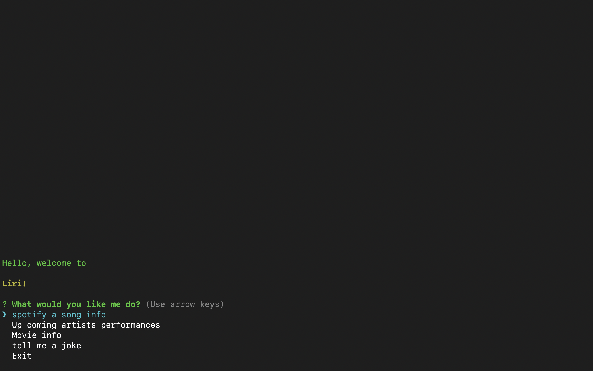

### Liri Bot
--------------------
#####  LIRI is a Language Interpretation and Recognition Interface. LIRI will be a command line node app that takes in parameters and gives you back data.

### Future implementations.

* Voice recognition
* Web Search

------
### Video Demo

---

## Technologies usen on the project
* Github
###### Github is a remote repository where we can store versions of our code.
* Gitlab
###### GitLab is a web-based DevOps lifecycle tool that provides a Git-repository manager providing wiki, issue-tracking and CI/CD pipeline features, using an open-source license, developed by GitLab Inc.

* JavaScript
###### JavaScript, often abbreviated as JS, is a high-level, interpreted scripting language that conforms to the ECMAScript specification. JavaScript has curly-bracket syntax, dynamic typing, prototype-based object-orientation, and first-class functions.

---
> Author
 Alexei Dias
 Linkedin 
 https://www.linkedin.com/in/alexei-dias-b4054a164/